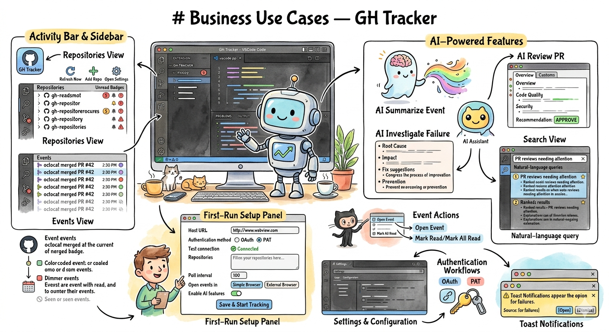
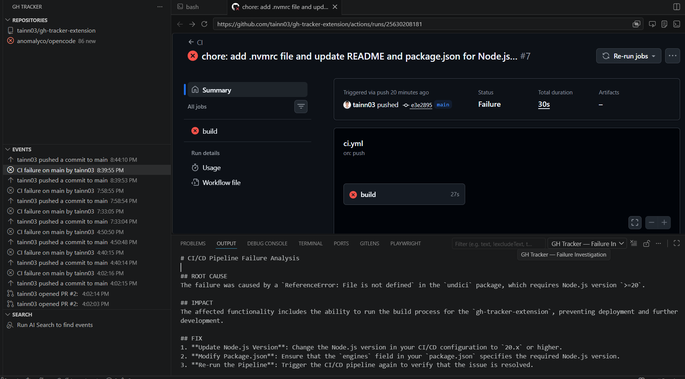

<h1 align="center">GH Tracker</h1>
<p align="center">
  <picture>
    <source srcset="usecase.png" media="(prefers-color-scheme: dark)">
    <source srcset="usecase.png" media="(prefers-color-scheme: light)">
    
  </picture>
  <br>
  
</p>

The VSCode extension for real-time event tracking for GitHub / GHE repositories directly in VSCode. Polls repositories for PRs, pushes, workflow runs, and more — with AI-powered summaries, code reviews, and failure investigations.

## Features

| Feature | Description |
|---------|-------------|
| **Multi-repo tracking** | Monitor any number of GitHub.com or GitHub Enterprise repositories |
| **Real-time polling** | Configurable interval (30s+) — new events appear automatically |
| **Toast notifications** | Smart notification level: all events, important only, or failures only |
| **Event filtering** | Filter by event type (PR, push, workflow, etc.) and/or specific actors |
| **Sidebar tree views** | Repository list with unread badges + per-repo event list |
| **Event actions** | Open in VSCode Simple Browser or external browser; mark read |
| **AI Summarize** | One-click AI summary of any event with full context (PR diffs, commit messages, workflow logs) using Copilot LM API |
| **AI PR Review** | Full code review including diff, comments, reviews, and inline feedback |
| **AI Failure Investigation** | Root-cause analysis with log tail for failed CI/CD pipelines |
| **AI Event Search** | Natural-language semantic search across stored events |
| **Flexible auth** | Built-in GitHub OAuth or PAT-based authentication |
| **Persistent storage** | JSON file-backed event history with 30-day auto-cleanup |
| **Open source** | MIT-licensed, contributions welcome |

## How to install

**Prerequisites:** VSCode ≥ 1.90.

### Install from VSIX (recommended)

1. [Download the latest `.vsix` from Releases](https://github.com/ngtai/gh-tracker/releases) or build it yourself (`npm run package`).
2. Open VSCode → Extensions view (`Ctrl+Shift+X`).
3. Click the `…` (More Actions) menu → **Install from VSIX...**.
4. Select the `.vsix` file.
5. The extension activates automatically. Open the GH Tracker setup panel from the activity bar or via `Ctrl+Shift+P` → `GH Tracker: Open Setup`.

### Build from source

```bash
git clone https://github.com/ngtai/gh-tracker.git
cd gh-tracker
npm install
npm run package
# Output: gh-tracker-<version>.vsix in the project root
```

## Development

**Requirements:** Node.js ≥ 20 (Node 18 is EOL and incompatible with npm's undici dependency).

1. `npm install`
2. `npm run watch`
3. Press `F5` to start debugging.

```bash
# Type-check
npm run typecheck

# Lint
npm run lint

# Package
npm run package
```
